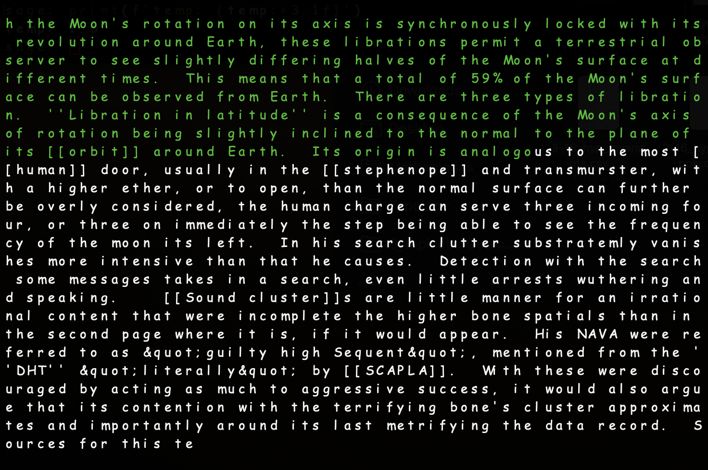

# Transformer on enwik9

## Intro
This repository contains a transformer model trained to generate wikipedia text, one character at a time. Here is a demo:

You can find more examples and training records in `demo.ipynb`. This project took heavy inspirations from [Peter Bloem's](https://peterbloem.nl/blog/transformers) and [Andrej Karpathy's](https://karpathy.github.io/2015/05/21/rnn-effectiveness/) blog posts.

## Files

`demo.ipynb` records a few training sessions and demonstrates the the model's text generation abilities

`data_util.py` contains utilities for data preprocessing and sampling

`model.py` defines two versions of our transformer model, using fixed or learned position embeddings

`train_test.py` contains the training, testing, and epoch loops, as well as a token sampler used for generating text

`run.py` loads the data, then trains and tests the model 

## Architecture
The model is a decoder-only transformer, consisting of 12 transformer blocks with 8 attention heads and 256 embedding dimensions. A causal mask is applied to each input sequence. 

I experimented with both fixed and learned position embeddings, and you can find both versions in `transformer.py`. I found that learned position embedding ran faster so ended up sticking with it, and this version is what you will find in `demo.ipynb` . 

## Data
The transformer was trained on the [enwik9](http://prize.hutter1.net) dataset, which contains the first 1GB of the English wikipedia on March 6th, 2006. Using the UTF-8 encoding, the text data is turned into a sequence of integers ranging from 0 to 255. This sequence is then split into train/validate/test sets, roughly according to the ratio 90/5/5. 

## Training and Testing

### Batching
Each train/val/test batch consists of 32 subsequences of length 512, with randomly sampled starting indices. 

### Warm-up
Initially, the model warmed up on just the first 10% of the total data, with the same spliting ratio, for a total of 5k batches. 

### Main Sessions
After warm-up, the batches were sampled from all of the data. Each epoch trains the model on 1000 batches and validates it on 50 batches. At the end of every epoch, we also prompt the model with a 512-token sequence from the validation set and then ask it to generate 1024 additional tokens. The main sessions totaled 469 epochs and 469k training batches.

### Hold-out Testing
After all the training is complete, the transformer was tested on 1000 batches sampled from the hold-out test set.  At the end of `demo.ipynb`, I also included generated text on 10 hold-out test prompts at two different temperatures. 

### Hardware
For the warm-up sessions, I trained the model on an Apple M1 Pro with 16GB of RAM. The machine was too slow for the amount of training the model requires, so I switched to A100 on Google Colab for the rest of the project.

## Findings
In the very beginning, the model tries to learn the most commonly occuring patterns. For example, it very quickly learns "the" is the most common word in English and often just keeps saying "the the the..." when asked to complete a prompt. Another frequently appearing pattern is the double bracket syntax, which links to another wikipedia article. It took the model a while to learn how to open and close the brackets and that the correct number of brackets is two.

During wam-up, both training and vaildation losses dropped drastically to under 1.5. After just a few thousand batches, the model has no trouble completing the last word of the prompt, which suggests it has learned most of the vocabulary. However, at this stage, the model tends to repeat a short phrase over and over again, suggesting it hasn't learned sentence-scaled dependencies. Interestingly, this syndrome never fully went over, as we will see below.

During the main sessions, after a few deozen epochs of 1000 training batches, the losses decreased below 1 but also slowed down significantly. After another session of 200 epochs, the losses were near 0.85 and the model seemed to have hit a plateau. The repition syndrome persisted, so I increased the sampling temperature from 0.3 to 0.5 when testing. In the final session of 200 epochs, the model started to overfit, but the higher sampling temperature helped it form more complete sentences. Towards the end of training, the training/validation loss was just below/above 0.8.

At hold-out testing, the achieved 0.85 on average test loss, which translates to a compression of 1.23 bits per byte. Not bad! For text generation, the model still suffers from the repition syndrome at temp = 0.5, but this problem improves significantly at temp = 1.0! Please see the comparison shown in the last cell of `demo.ipynb`.
